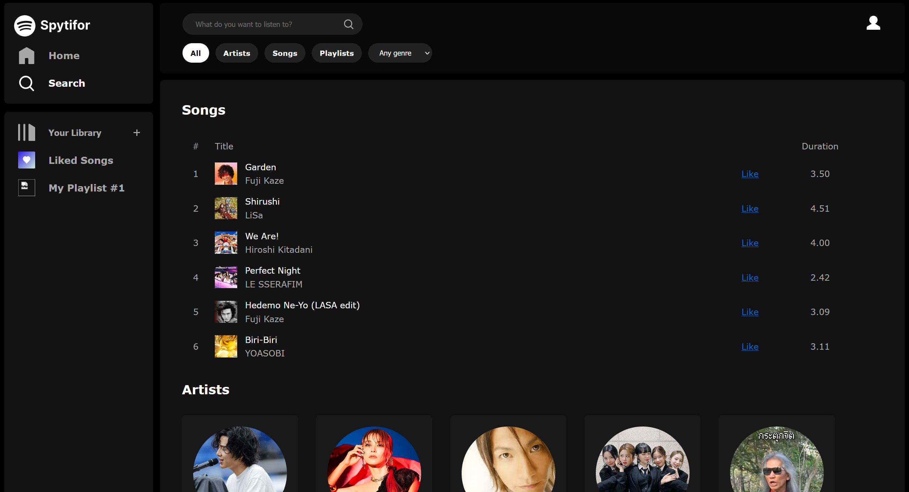
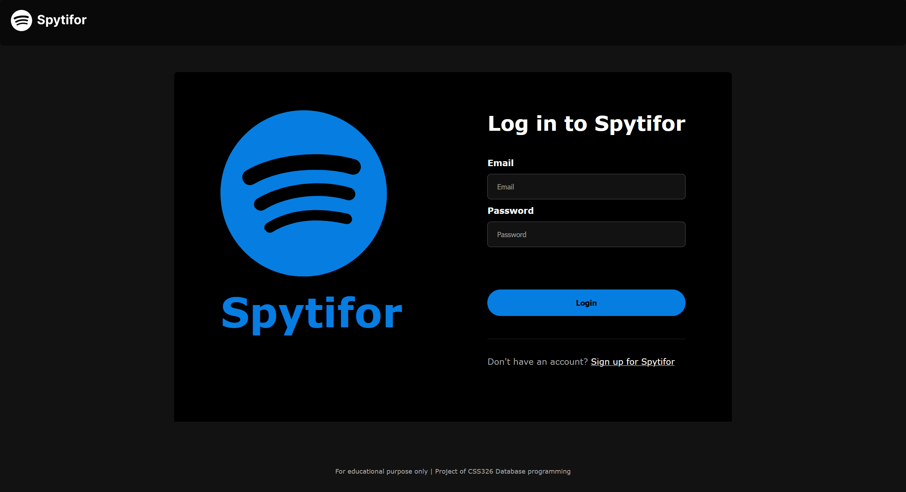

# Spytifor
### Spotify Clone Web Application

Spytifor, the music streaming platform project, is a web-based application that tries to replicate the basic functionality and user experience of the popular music streaming platform, Spotify. This project aims to provide users who want to listen to music with a familiar and enjoyable way to discover, listen to, and manage music content. This project focuses on the Back-end side

### Development
- PHP, HTML, CSS, JavaScript, SQL, MAMP

### Preview






### Fundamental functionalities
**User**
- Register
- Login
- Listen to music
- Search for music, artist, or playlist with some filter
- Create your own playlist
- Modify your own playlist and user profile
    - add songs into your playlist
    - delete songs from your playlists
    - delete your playlists
    - edit your playlist's name
    - edit user's name
- Have your own liked songs playlist

**Administrator**
- Login as administrator
- Add music, admin's playlist, genre, and artist
- Delete music, admin's playlist, genre, and artist

**Superadmin**
- Have all admin privileges
- Manage user's role

### Before use
- Please create "spytifor" database and import [spytifor.sql](spytifor.sql) into that database
```
CREATE DATABASE spytifor;
``` 

- Also, please create required database users and grant privileges to them
```
CREATE USER spytiforuser IDENTIFIED BY '#qdWani$X3jAUHkK';
CREATE USER spytiforadmin IDENTIFIED BY 'njbuJv5FYb*xYsX%';

GRANT USAGE ON *.* TO 'spytiforadmin'@'%'
GRANT SELECT, INSERT, UPDATE, DELETE ON `spytifor`.`role` TO 'spytiforadmin'@'%'
GRANT SELECT, INSERT, UPDATE, DELETE ON `spytifor`.`genre` TO 'spytiforadmin'@'%'
GRANT SELECT, INSERT, DELETE ON `spytifor`.`playlist_music` TO 'spytiforadmin'@'%'
GRANT SELECT, INSERT, UPDATE, DELETE ON `spytifor`.`playlist` TO 'spytiforadmin'@'%'
GRANT SELECT, INSERT, UPDATE, DELETE ON `spytifor`.`music` TO 'spytiforadmin'@'%'
GRANT SELECT, INSERT, UPDATE, DELETE ON `spytifor`.`artist` TO 'spytiforadmin'@'%'
GRANT SELECT, UPDATE (role_id) ON `spytifor`.`user` TO 'spytiforadmin'@'%'

GRANT USAGE ON *.* TO 'spytiforuser'@'%'
GRANT SELECT, INSERT, UPDATE, DELETE ON `spytifor`.`playlist` TO 'spytiforuser'@'%'
GRANT SELECT, INSERT, UPDATE ON `spytifor`.`user` TO 'spytiforuser'@'%'
GRANT SELECT ON `spytifor`.`artist` TO 'spytiforuser'@'%'
GRANT SELECT ON `spytifor`.`genre` TO 'spytiforuser'@'%'
GRANT SELECT, INSERT, DELETE ON `spytifor`.`liked` TO 'spytiforuser'@'%'
GRANT SELECT ON `spytifor`.`music` TO 'spytiforuser'@'%'
GRANT SELECT, INSERT, DELETE ON `spytifor`.`playlist_music` TO 'spytiforuser'@'%'
```

## Related Course
CSS326 Database programming Laboratory

Sirindhorn International Institute of Technology (SIIT), Thammasat University


